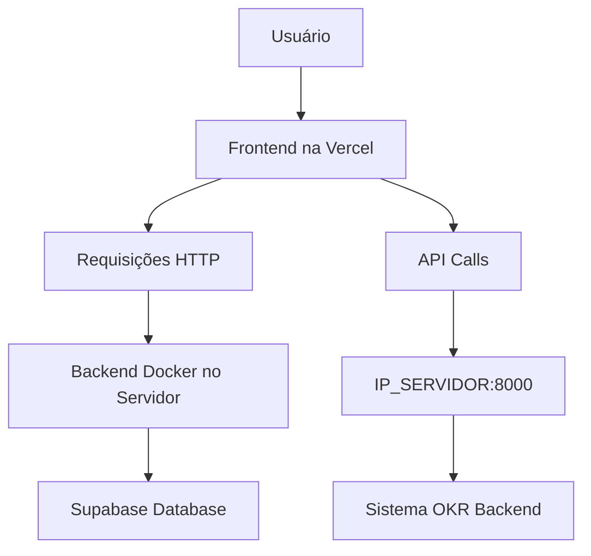

# Guia de Deploy Docker - Sistema OKR Backend

## 🏗️ Arquitetura da Solução

### Visão Geral
O sistema é dividido em duas partes principais:

1. **Frontend** (Vercel) - `https://okr.nobug.com.br` / `https://okr-flow.vercel.app`
2. **Backend** (Docker no servidor da empresa) - `http://IP_DO_SERVIDOR:8000`

### Como Funciona a Conexão



## 🔧 Configuração no Servidor da Empresa

### 1. Pré-requisitos

```bash
# Instalar Docker
curl -fsSL https://get.docker.com -o get-docker.sh
sudo sh get-docker.sh

# Instalar Docker Compose
sudo curl -L "https://github.com/docker/compose/releases/download/v2.20.0/docker-compose-$(uname -s)-$(uname -m)" -o /usr/local/bin/docker-compose
sudo chmod +x /usr/local/bin/docker-compose
```

### 2. Configurar Variáveis de Ambiente

Crie um arquivo `.env` no diretório do backend:

```env
# Configurações Obrigatórias do Supabase
SUPABASE_URL=https://seu-projeto.supabase.co
SUPABASE_KEY=sua-chave-publica
SUPABASE_SERVICE_KEY=sua-chave-de-servico

# Configurações de Ambiente
ENVIRONMENT=production
FRONTEND_URL=https://okr.nobug.com.br

# Configurações de Performance (opcionais)
WORKERS_COUNT=4
TIMEOUT_KEEP_ALIVE=65
ENABLE_GZIP=true
LOG_LEVEL=WARNING

# Configurações de Cache (opcionais)
CACHE_TTL=300
CACHE_MAXSIZE=1000

# Configurações de JWT (opcionais)
JWT_EXPIRATION_TIME=2592000
JWT_REFRESH_EXPIRATION_TIME=7776000
SESSION_TIMEOUT=86400
```

### 3. Executar o Sistema

```bash
# Fazer build e executar
docker-compose up -d

# Verificar status
docker-compose ps

# Ver logs
docker-compose logs -f okr-backend

# Parar sistema
docker-compose down
```

## 🌐 Configuração da Conexão Frontend-Backend

### 1. IP/URL do Servidor

Após o deploy, o backend estará disponível em:
- **IP Local**: `http://IP_DO_SERVIDOR:8000`
- **Domínio**: `http://seu-dominio.com:8000` (se tiver domínio)

### 2. Configurar no Frontend (Vercel)

No painel da Vercel, adicione as seguintes variáveis de ambiente:

```env
VITE_API_URL=http://IP_DO_SERVIDOR:8000
VITE_API_BASE_URL=http://IP_DO_SERVIDOR:8000/api
```

### 3. Verificar CORS

O backend já está configurado para aceitar requisições dos domínios:
- `https://okr.nobug.com.br`
- `https://okr-flow.vercel.app`
- `https://okr-flow-*.vercel.app`

## 🛡️ Segurança e Redes

### Configuração de Firewall

```bash
# Permitir porta 8000
sudo ufw allow 8000/tcp

# Verificar regras
sudo ufw status
```

### Configuração de Proxy Reverso (Opcional)

Para usar HTTPS, configure um proxy reverso com Nginx:

```nginx
server {
    listen 443 ssl;
    server_name api.seu-dominio.com;
    
    ssl_certificate /path/to/cert.pem;
    ssl_certificate_key /path/to/key.pem;
    
    location / {
        proxy_pass http://localhost:8000;
        proxy_set_header Host $host;
        proxy_set_header X-Real-IP $remote_addr;
        proxy_set_header X-Forwarded-For $proxy_add_x_forwarded_for;
        proxy_set_header X-Forwarded-Proto $scheme;
    }
}
```

## 📊 Monitoramento e Logs

### Verificar Saúde do Sistema

```bash
# Health check
curl http://localhost:8000/health

# Status detalhado
curl http://localhost:8000/debug/connectivity
```

### Logs em Tempo Real

```bash
# Logs do container
docker-compose logs -f okr-backend

# Logs específicos
docker-compose logs --tail=100 okr-backend
```

### Arquivos de Log

Os logs são salvos em:
- `./logs/app.log` - Logs da aplicação
- `./logs/error.log` - Logs de erro
- `./logs/access.log` - Logs de acesso

## 🔄 Processo de Atualização

### Atualizar Sistema

```bash
# Parar serviços
docker-compose down

# Atualizar código
git pull origin main

# Fazer novo build
docker-compose up -d --build

# Verificar status
docker-compose ps
```

### Backup e Restore

```bash
# Backup de configurações
cp .env .env.backup
cp docker-compose.yml docker-compose.yml.backup

# Backup de logs
tar -czf logs-backup-$(date +%Y%m%d).tar.gz ./logs/
```

## 🚨 Resolução de Problemas

### Problemas Comuns

1. **Erro de Conexão com Supabase**
   ```bash
   # Verificar variáveis de ambiente
   docker-compose exec okr-backend env | grep SUPABASE
   
   # Testar conectividade
   curl http://localhost:8000/debug/connectivity
   ```

2. **Erro de CORS**
   ```bash
   # Verificar logs
   docker-compose logs okr-backend | grep -i cors
   
   # Verificar configuração
   curl -H "Origin: https://okr.nobug.com.br" http://localhost:8000/health
   ```

3. **Alto Uso de Recursos**
   ```bash
   # Monitorar recursos
   docker stats okr-flow-backend
   
   # Ajustar workers
   docker-compose up -d --scale okr-backend=1
   ```

### Comandos Úteis

```bash
# Entrar no container
docker-compose exec okr-backend bash

# Verificar processos
docker-compose exec okr-backend ps aux

# Verificar configuração Python
docker-compose exec okr-backend python -c "from app.core.settings import settings; print(settings.SUPABASE_URL)"

# Reiniciar apenas o serviço
docker-compose restart okr-backend
```

## 📋 Checklist de Deploy

- [ ] Docker e Docker Compose instalados
- [ ] Arquivo `.env` configurado com credenciais Supabase
- [ ] Firewall configurado (porta 8000)
- [ ] Sistema executando: `docker-compose up -d`
- [ ] Health check funcionando: `curl http://localhost:8000/health`
- [ ] Frontend configurado com IP/URL do servidor
- [ ] CORS funcionando (testar requisições do frontend)
- [ ] Logs sendo gerados corretamente
- [ ] Backup das configurações realizado

## 📞 Contato de Suporte

Em caso de problemas, verificar:
1. Logs do sistema: `docker-compose logs -f`
2. Health check: `curl http://localhost:8000/health`
3. Conectividade: `curl http://localhost:8000/debug/connectivity`
4. Configurações de rede e firewall

---

**Importante**: O IP ou domínio do servidor onde o Docker está rodando deve ser configurado no frontend (Vercel) para que a comunicação funcione corretamente. 