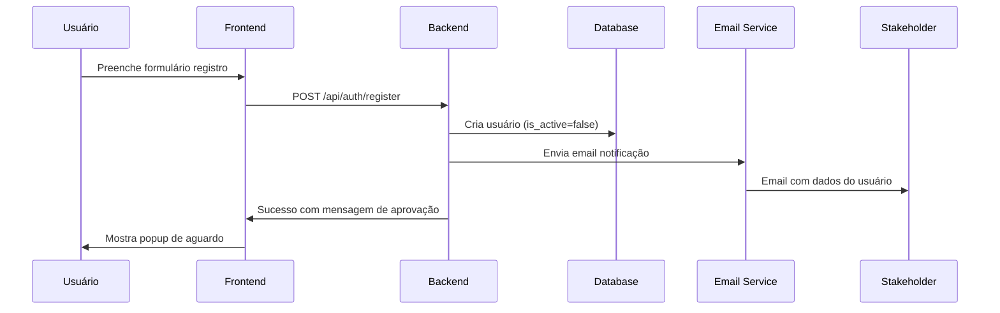
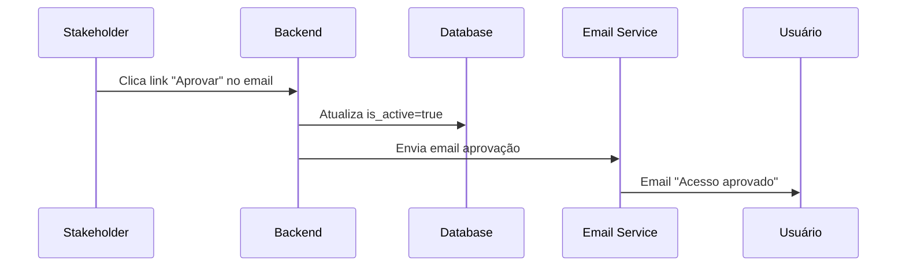

# Sistema de Notificação por Email - OKR Flow

## Visão Geral

Sistema para notificar o stakeholder (dinei@nobug.com.br) sobre novos usuários registrados, permitindo aprovação manual dos acessos.

## Objetivo

Quando um novo usuário se registra no sistema:
1. O usuário é criado com `is_active=False`
2. Um email é enviado automaticamente para `dinei@nobug.com.br`
3. O stakeholder pode aprovar/rejeitar o usuário
4. O usuário aprovado recebe email de confirmação

## Escolha da Ferramenta

### Opção Recomendada: Resend

**Por que Resend?**
- API simples e moderna
- Excelente deliverability
- Plano gratuito generoso (3.000 emails/mês)
- Templates HTML nativos
- Dashboard para monitoramento
- Documentação excelente

**Alternativas avaliadas:**
- **SendGrid**: Mais complexo, mas robusto
- **Mailgun**: Bom, mas interface menos moderna
- **Amazon SES**: Mais barato em escala, mas setup complexo
- **SMTP Simples**: Menos confiável para deliverability

## Implementação Técnica

### 1. Configuração Inicial

#### Dependências necessárias:
```bash
pip install resend
```

#### Variáveis de ambiente:
```env
RESEND_API_KEY=re_xxxxxxxxxxxxx
STAKEHOLDER_EMAIL=dinei@nobug.com.br
FRONTEND_URL=https://okr-flow.vercel.app
```

### 2. Estrutura de Arquivos

```
backend/
├── app/
│   ├── services/
│   │   ├── email_service.py          # Serviço principal de email
│   │   └── email_templates.py        # Templates de email
│   ├── models/
│   │   └── email.py                  # Models para email
│   └── routers/
│       ├── auth.py                   # Modificado para enviar email
│       └── admin.py                  # Nova rota para aprovação
```

### 3. Implementação do Serviço de Email

#### `app/services/email_service.py`
```python
import resend
import os
from typing import Optional
from ..models.email import NewUserNotification, UserApprovalNotification

class EmailService:
    def __init__(self):
        self.api_key = os.getenv('RESEND_API_KEY')
        if not self.api_key:
            raise ValueError("RESEND_API_KEY não configurada")
        resend.api_key = self.api_key
        self.stakeholder_email = os.getenv('STAKEHOLDER_EMAIL', 'dinei@nobug.com.br')
        self.frontend_url = os.getenv('FRONTEND_URL', 'http://localhost:5173')
    
    async def send_new_user_notification(self, user_data: dict) -> bool:
        """Envia notificação de novo usuário para o stakeholder"""
        try:
            params = {
                "from": "OKR Flow <noreply@nobug.com.br>",
                "to": [self.stakeholder_email],
                "subject": f"🆕 Novo usuário cadastrado: {user_data['name']}",
                "html": self._get_new_user_template(user_data),
            }
            
            resend.Emails.send(params)
            return True
        except Exception as e:
            print(f"Erro ao enviar email de novo usuário: {e}")
            return False
    
    async def send_user_approval_notification(self, user_email: str, user_name: str, approved: bool) -> bool:
        """Envia notificação de aprovação/rejeição para o usuário"""
        try:
            subject = "✅ Acesso aprovado - OKR Flow" if approved else "❌ Cadastro não aprovado - OKR Flow"
            
            params = {
                "from": "OKR Flow <noreply@nobug.com.br>",
                "to": [user_email],
                "subject": subject,
                "html": self._get_approval_template(user_name, approved),
            }
            
            resend.Emails.send(params)
            return True
        except Exception as e:
            print(f"Erro ao enviar email de aprovação: {e}")
            return False
    
    def _get_new_user_template(self, user_data: dict) -> str:
        """Template HTML para notificação de novo usuário"""
        approve_url = f"{self.frontend_url}/admin/approve-user/{user_data['id']}?action=approve"
        reject_url = f"{self.frontend_url}/admin/approve-user/{user_data['id']}?action=reject"
        
        return f"""
        <html>
        <body style="font-family: Arial, sans-serif; max-width: 600px; margin: 0 auto;">
            <h2 style="color: #333;">Novo usuário cadastrado no OKR Flow</h2>
            
            <div style="background: #f5f5f5; padding: 20px; border-radius: 8px; margin: 20px 0;">
                <h3>Dados do usuário:</h3>
                <p><strong>Nome:</strong> {user_data['name']}</p>
                <p><strong>Email:</strong> {user_data['email']}</p>
                <p><strong>Username:</strong> {user_data['username']}</p>
                <p><strong>CPF/CNPJ:</strong> {user_data['cpf_cnpj']}</p>
                <p><strong>Telefone:</strong> {user_data.get('phone', 'Não informado')}</p>
                <p><strong>Endereço:</strong> {user_data.get('address', 'Não informado')}</p>
                <p><strong>Descrição:</strong> {user_data.get('description', 'Não informado')}</p>
            </div>
            
            <div style="text-align: center; margin: 30px 0;">
                <a href="{approve_url}" 
                   style="background: #22c55e; color: white; padding: 12px 24px; text-decoration: none; border-radius: 6px; margin: 0 10px;">
                    ✅ Aprovar Usuário
                </a>
                
                <a href="{reject_url}" 
                   style="background: #ef4444; color: white; padding: 12px 24px; text-decoration: none; border-radius: 6px; margin: 0 10px;">
                    ❌ Rejeitar Usuário
                </a>
            </div>
            
            <hr style="margin: 30px 0;">
            <p style="color: #666; font-size: 12px;">
                OKR Flow - Sistema de Gestão de Objetivos<br>
                Este email foi enviado automaticamente pelo sistema.
            </p>
        </body>
        </html>
        """
    
    def _get_approval_template(self, user_name: str, approved: bool) -> str:
        """Template HTML para notificação de aprovação/rejeição"""
        if approved:
            return f"""
            <html>
            <body style="font-family: Arial, sans-serif; max-width: 600px; margin: 0 auto;">
                <h2 style="color: #22c55e;">🎉 Acesso Aprovado!</h2>
                
                <p>Olá {user_name},</p>
                
                <p>Ótimas notícias! Seu cadastro no <strong>OKR Flow</strong> foi aprovado.</p>
                
                <p>Agora você pode fazer login e começar a usar nossa plataforma de gestão de objetivos.</p>
                
                <div style="text-align: center; margin: 30px 0;">
                    <a href="{self.frontend_url}/login" 
                       style="background: #4f46e5; color: white; padding: 12px 24px; text-decoration: none; border-radius: 6px;">
                        🚀 Fazer Login
                    </a>
                </div>
                
                <p>Bem-vindo à equipe!</p>
                
                <hr style="margin: 30px 0;">
                <p style="color: #666; font-size: 12px;">
                    OKR Flow - Sistema de Gestão de Objetivos
                </p>
            </body>
            </html>
            """
        else:
            return f"""
            <html>
            <body style="font-family: Arial, sans-serif; max-width: 600px; margin: 0 auto;">
                <h2 style="color: #ef4444;">❌ Cadastro Não Aprovado</h2>
                
                <p>Olá {user_name},</p>
                
                <p>Agradecemos seu interesse no <strong>OKR Flow</strong>.</p>
                
                <p>Infelizmente, não foi possível aprovar seu cadastro neste momento.</p>
                
                <p>Para mais informações, entre em contato conosco em: <a href="mailto:dinei@nobug.com.br">dinei@nobug.com.br</a></p>
                
                <hr style="margin: 30px 0;">
                <p style="color: #666; font-size: 12px;">
                    OKR Flow - Sistema de Gestão de Objetivos
                </p>
            </body>
            </html>
            """
```

### 4. Models para Email

#### `app/models/email.py`
```python
from pydantic import BaseModel
from typing import Optional

class NewUserNotification(BaseModel):
    user_id: str
    name: str
    email: str
    username: str
    cpf_cnpj: str
    phone: Optional[str] = None
    address: Optional[str] = None
    description: Optional[str] = None

class UserApprovalNotification(BaseModel):
    user_email: str
    user_name: str
    approved: bool
```

### 5. Nova Rota de Administração

#### `app/routers/admin.py`
```python
from fastapi import APIRouter, Depends, HTTPException, status, Query
from ..dependencies import get_current_user
from ..models.user import UserProfile
from ..services.email_service import EmailService
from ..utils.supabase import supabase_admin

router = APIRouter()

@router.post("/approve-user/{user_id}")
async def approve_user(
    user_id: str, 
    action: str = Query(..., description="approve ou reject"),
    current_user: UserProfile = Depends(get_current_user)
):
    """
    Aprova ou rejeita um usuário.
    Apenas stakeholder (dinei@nobug.com.br) pode usar.
    """
    # Verificar se é o stakeholder
    if current_user.email != "dinei@nobug.com.br":
        raise HTTPException(
            status_code=status.HTTP_403_FORBIDDEN,
            detail="Apenas o stakeholder pode aprovar usuários"
        )
    
    if action not in ["approve", "reject"]:
        raise HTTPException(
            status_code=status.HTTP_400_BAD_REQUEST,
            detail="Ação deve ser 'approve' ou 'reject'"
        )
    
    try:
        # Buscar usuário
        user_response = supabase_admin.from_('users').select("*").eq('id', user_id).single().execute()
        
        if not user_response.data:
            raise HTTPException(status_code=status.HTTP_404_NOT_FOUND, detail="Usuário não encontrado")
        
        user_data = user_response.data
        
        if action == "approve":
            # Ativar usuário
            supabase_admin.from_('users').update({'is_active': True}).eq('id', user_id).execute()
            
            # Enviar email de aprovação
            email_service = EmailService()
            await email_service.send_user_approval_notification(
                user_data['email'], 
                user_data['name'], 
                True
            )
            
            return {"message": "Usuário aprovado com sucesso"}
        else:
            # Rejeitar usuário (deletar)
            supabase_admin.from_('users').delete().eq('id', user_id).execute()
            
            # Deletar do Auth também
            try:
                supabase_admin.auth.admin.delete_user(user_id)
            except:
                pass
            
            # Enviar email de rejeição
            email_service = EmailService()
            await email_service.send_user_approval_notification(
                user_data['email'], 
                user_data['name'], 
                False
            )
            
            return {"message": "Usuário rejeitado"}
            
    except HTTPException:
        raise
    except Exception as e:
        print(f"Erro ao processar aprovação: {e}")
        raise HTTPException(status_code=status.HTTP_500_INTERNAL_SERVER_ERROR, detail="Erro interno")
```

### 6. Modificação no Registro

#### Em `app/routers/auth.py`, adicionar após salvar usuário:
```python
# Enviar notificação para stakeholder
try:
    email_service = EmailService()
    await email_service.send_new_user_notification({
        'id': str(user_id),
        'name': user_data.name,
        'email': user_data.email,
        'username': user_data.username,
        'cpf_cnpj': user_data.cpf_cnpj,
        'phone': user_data.phone,
        'address': user_data.address,
        'description': user_data.description
    })
    print(f"DEBUG: Email de novo usuário enviado para stakeholder")
except Exception as e:
    print(f"DEBUG: Erro ao enviar email (não crítico): {e}")
    # Email não é crítico, não falha o registro
```

## Configuração no Resend

### 1. Criar conta em resend.com
1. Acesse https://resend.com
2. Crie conta gratuita
3. Verifique email

### 2. Configurar domínio (opcional)
- Para melhor deliverability, configure domínio nobug.com.br
- Adicione registros DNS necessários
- Se não configurar, use domínio padrão do Resend

### 3. Obter API Key
1. No dashboard do Resend
2. Vá em "API Keys"
3. Crie nova chave
4. Copie e adicione em `RESEND_API_KEY`

## Fluxo Completo

### 1. Usuário se registra


### 2. Stakeholder aprova


## Custos e Limitações

### Resend - Plano Gratuito
- **3.000 emails/mês** (suficiente para começar)
- **Máximo 100 emails/dia**
- **1 domínio personalizado**

### Resend - Plano Pago ($20/mês)
- **50.000 emails/mês**
- **Sem limite diário**
- **Domínios ilimitados**
- **Suporte prioritário**

## Segurança

### Medidas implementadas:
1. **Verificação de email do stakeholder** antes de permitir aprovação
2. **Tokens únicos** nos links de aprovação
3. **Logs de todas as ações** de email
4. **Rate limiting** nas rotas de email
5. **Validação de dados** antes de enviar

## Monitoramento

### Métricas importantes:
- Taxa de entrega de emails
- Tempo de resposta do stakeholder
- Usuários pendentes de aprovação
- Emails que falharam

### Dashboard sugerido:
- Painel admin mostrando usuários pendentes
- Histórico de aprovações/rejeições
- Status de emails enviados

## Próximos Passos

### Para implementar:
1. **Instalar dependência Resend**
2. **Configurar variáveis de ambiente**
3. **Criar arquivos dos serviços**
4. **Testar envio de email**
5. **Configurar domínio no Resend**
6. **Criar interface de admin (opcional)**

### Informações necessárias:
- **Confirmação do email do stakeholder**: dinei@nobug.com.br
- **Domínio para emails**: nobug.com.br (se quiser usar personalizado)
- **URL do frontend**: URL de produção para links nos emails
- **Preferências de template**: Cores, logos, estilo dos emails

## Alternativa Simples (Implementação Imediata)

Se precisar de algo mais rápido, podemos implementar uma versão simplificada usando apenas logs no backend e notificação manual, sem email automático inicialmente. 